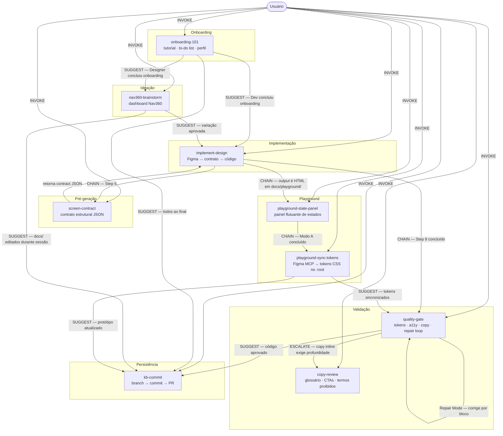

# Skills — Protocolo de Comunicação

> Especificação de orquestração das skills do Cursor para o repositório `dasa-design-kb`.
> Define o vocabulário de mensagens, os contratos de cada skill e as regras de roteamento.

---

## As 9 skills do ecossistema

| Skill | Fase | Escopo | Arquivo |
|---|---|---|---|
| [`onboarding-101`](.cursor/skills/onboarding-101/SKILL.md) | Onboarding | Tutorial interativo com to-do list por perfil para novos membros | `.cursor/skills/onboarding-101/SKILL.md` |
| [`nav360-brainstorm`](.cursor/skills/nav360-brainstorm/SKILL.md) | Ideação | Variações de UX/UI para módulos do Nav360 | `.cursor/skills/nav360-brainstorm/SKILL.md` |
| [`screen-contract`](.cursor/skills/screen-contract/SKILL.md) | Pré-geração | Converte frame Figma, screenshot ou brief em contrato estrutural JSON | `.cursor/skills/screen-contract/SKILL.md` |
| [`implement-design`](.cursor/skills/implement-design/SKILL.md) | Implementação | Converte frame Figma em código production-ready (usa `screen-contract`) | `.cursor/skills/implement-design/SKILL.md` |
| [`playground-state-panel`](.cursor/skills/playground-state-panel/SKILL.md) | Playground | Injeta painel flutuante de estados em HTML protótipos | `.cursor/skills/playground-state-panel/SKILL.md` |
| [`playground-sync-tokens`](.cursor/skills/playground-sync-tokens/SKILL.md) | Playground | Sincroniza tokens do DS Dasa (Figma MCP) no `:root` dos protótipos | `.cursor/skills/playground-sync-tokens/SKILL.md` |
| [`quality-gate`](.cursor/skills/quality-gate/SKILL.md) | Validação | Valida código contra tokens, a11y, copy e DS; Repair Mode por blocos | `.cursor/skills/quality-gate/SKILL.md` |
| [`copy-review`](.cursor/skills/copy-review/SKILL.md) | Validação | Revisa textos contra as regras de copy Dasa | `.cursor/skills/copy-review/SKILL.md` |
| [`kb-commit`](.cursor/skills/kb-commit/SKILL.md) | Persistência | Valida, commita e abre PR com mudanças no KB | `.cursor/skills/kb-commit/SKILL.md` |

---

## Vocabulário do protocolo

Cada comunicação entre skills tem um tipo explícito. O AI deve usar este vocabulário para determinar quando e como acionar cada skill.

| Tipo | Significado | Obrigatório |
|---|---|---|
| `INVOKE` | Usuário aciona a skill diretamente | — |
| `CHAIN` | Skill A passa execução para Skill B obrigatoriamente ao final | Sim — sem exceção |
| `ESCALATE` | Skill A delega parte do trabalho para Skill B condicionalmente | Só se a condição for verdadeira |
| `SUGGEST` | Skill A recomenda Skill B ao usuário, mas não a aciona | Não — depende do usuário |
| `REJECT` | Skill A recusa o pedido e redireciona para a skill correta | — |

---

## Diagrama do protocolo



---

## Contratos por skill

### `onboarding-101`

```
FASE:         Onboarding
ACCEPTS:      pedido de onboarding, "como funciona o KB", "101", "por onde começo", perfil informado (Designer / Dev / PM)
PRODUCES:     to-do list personalizada por perfil + acompanhamento passo a passo com validação + resumo final
CHAINS_TO:    —
ESCALATES_TO: —
SUGGESTS:     nav360-brainstorm — Designer ao concluir onboarding
              implement-design  — Dev ao concluir onboarding
              kb-commit         — todos ao final do tutorial
REJECTS_TO:   skill correta — se o usuário quiser executar uma tarefa específica (não onboarding)
```

**Condição de escopo:** skill de entrada — não é acionada por outras skills, nem deve ser encadeada. É sempre invocada diretamente pelo usuário ao iniciar no repositório.

---

### `nav360-brainstorm`

```
FASE:         Ideação
ACCEPTS:      descrição de módulo, problema de UX, tela do Nav360 (dashboard/portal logado)
PRODUCES:     2–3 variações com benchmark, regra Nav360, status de hipótese e checklist
CHAINS_TO:    —
ESCALATES_TO: —
SUGGESTS:     implement-design  — quando uma variação for aprovada para implementação
              kb-commit         — quando docs/ forem editados durante a sessão de brainstorm
REJECTS_TO:   quality-gate      — se o pedido for validação de código gerado
              implement-design  — se o pedido for implementação direta (sem brainstorm)
              copy-review       — se o pedido for revisão de textos isolados
```

**Condição de escopo:** se o produto não for Nav360 ou não for um dashboard/portal logado, a skill rejeita e informa que não existe skill adequada para o contexto por ora.

---

### `screen-contract`

```
FASE:         Pré-geração
ACCEPTS:      frame Figma (URL ou seleção), screenshot, brief textual, variação de nav360-brainstorm
PRODUCES:     screen contract JSON + resumo legível para confirmação humana
CHAINS_TO:    — (retorna ao caller — implement-design ou usuário)
ESCALATES_TO: —
SUGGESTS:     —
REJECTS_TO:   implement-design — se o usuário quiser código diretamente sem produzir contrato primeiro
```

**Regra central:** o contrato é um checkpoint humano. Apresentar, aguardar confirmação, só então sinalizar que está pronto para a geração de código.

---

### `implement-design`

```
FASE:         Implementação
ACCEPTS:      link Figma com node-id, seleção ativa no Figma Desktop App
PRODUCES:     screen contract confirmado + código production-ready com paridade visual 1:1, checklist de validação
CHAINS_TO:    screen-contract          — obrigatório no Step 5, sem exceção
              quality-gate             — obrigatório ao final do Step 8, sem exceção
              playground-state-panel   — quando o output for um HTML em docs/playground/
ESCALATES_TO: —
SUGGESTS:     —
REJECTS_TO:   quality-gate  — se o pedido for revisão de código já existente
              copy-review   — se o pedido for revisão de copy isolada sem código
```

**Pré-requisito:** Figma Desktop App aberto com Dev Mode ativo (`Shift+D`). Sem isso, a skill informa e aguarda.

---

### `playground-state-panel`

```
FASE:         Playground
ACCEPTS:      arquivo .html em docs/playground/ (existente ou recém-gerado) + descrição de módulos/estados a adicionar/alterar/remover
PRODUCES:     protótipo com painel flutuante funcional — CSS + HTML + JS injetados ou atualizados cirurgicamente
CHAINS_TO:    playground-sync-tokens — obrigatório ao final do Modo A (primeiro render), sem exceção
ESCALATES_TO: —
SUGGESTS:     quality-gate — após sync de tokens concluído
              kb-commit    — após protótipo validado e pronto
REJECTS_TO:   — (se o protótipo ainda não existe, informa e aguarda a criação)
```

**Regra estrutural:** o painel de estados é obrigatório em todo HTML gerado em `docs/playground/`. Só é removido mediante linguagem explícita e direta do usuário referindo-se ao painel especificamente.
**Regra de tokens:** todo novo protótipo (Modo A) deve ter os tokens sincronizados via `playground-sync-tokens` antes de ser considerado pronto. Modo B (atualização iterativa de estados) não exige novo CHAIN — tokens não mudam entre updates.

---

### `playground-sync-tokens`

```
FASE:         Playground
ACCEPTS:      "sincronize os tokens", "tokens desatualizados", "use os tokens do DS no protótipo", path de HTML em docs/playground/ ou "todos"
PRODUCES:     bloco :root atualizado com tokens reais do Figma + relatório de mudanças (atualizados / adicionados / sem correspondência)
CHAINS_TO:    —
ESCALATES_TO: —
SUGGESTS:     quality-gate — após sincronização, validar tokens injetados
              kb-commit    — após validação, commitar protótipos atualizados
REJECTS_TO:   — (se MCP indisponível, oferece fallback manual)
```

**Pré-requisito:** Figma Desktop App aberto com Dev Mode ativo (`Shift+D`). Sem isso, a skill informa e oferece fallback com valores manuais via `docs/specs/figma-mapping.md`.
**Regra estrutural:** edits cirúrgicos apenas no bloco `:root`. Nunca toca em HTML, JS ou qualquer outro trecho de CSS. Nunca regenera o protótipo.

---

### `quality-gate`

```
FASE:         Validação
ACCEPTS:      .tsx, .html, .css ou qualquer trecho de código de UI
PRODUCES:     relatório em 5 dimensões — tokens · touch targets · a11y · copy inline · componentes ad-hoc
              score final: APROVADO / APROVADO COM RESSALVAS / REPROVADO
CHAINS_TO:    —
ESCALATES_TO: copy-review — condição: componente tem muitas strings OR usuário pediu revisão de copy detalhada
SUGGESTS:     kb-commit   — após código aprovado, se arquivos em docs/ ou tokens/ foram editados
REJECTS_TO:   implement-design — se o pedido for implementar código do zero
              copy-review      — se o pedido for revisão de texto sem código
```

---

### `copy-review`

```
FASE:         Validação
ACCEPTS:      strings de texto, labels, CTAs, blocos de copy, telas em formato texto
PRODUCES:     tabela por dimensão — glossário · termos proibidos · CTA · capitalização · erros
              versão corrigida quando há problemas
CHAINS_TO:    —
ESCALATES_TO: —
SUGGESTS:     —
REJECTS_TO:   quality-gate — se o pedido incluir validação de tokens, a11y ou componentes
              kb-commit    — se o pedido for commitar mudanças
```

**Chamada por:** `quality-gate` via ESCALATE quando copy inline exige profundidade. Também acionada diretamente pelo usuário.

---

### `kb-commit`

```
FASE:         Persistência
ACCEPTS:      mudanças staged ou unstaged em docs/ ou tokens/
PRODUCES:     commit com mensagem Conventional Commits + PR aberto + URL do PR
CHAINS_TO:    —
ESCALATES_TO: —
SUGGESTS:     —
REJECTS_TO:   (kb.json) → PR no repositório dasa-figma-plugin, não aqui
              quality-gate → se o usuário quiser validar código antes de commitar
```

**Skill terminal:** não aciona nenhuma outra skill. Override de admin disponível via `admin-push.mdc`.

---

## Tabela de routing por intenção

Use esta tabela para determinar qual skill acionar com base no que o usuário disse ou no estado atual da sessão.

| Intenção detectada | Skill correta | Tipo |
|---|---|---|
| "como funciona o KB" / "101" / "onboarding" / "por onde começo" | `onboarding-101` | INVOKE |
| "quero aprender a usar o dasa-design-kb" / "é meu primeiro acesso" | `onboarding-101` | INVOKE |
| "brainstorm para o módulo X do Nav360" | `nav360-brainstorm` | INVOKE |
| "como resolver Y na home do Nav360" | `nav360-brainstorm` | INVOKE |
| "qual benchmark se aplica a Z" | `nav360-brainstorm` | INVOKE |
| "gere o screen contract para esse frame" / "monte o contrato antes de implementar" | `screen-contract` | INVOKE |
| "quero ver o contrato antes do código" | `screen-contract` | INVOKE |
| Output de `nav360-brainstorm` aprovado para implementação | `screen-contract` | SUGGEST |
| "implemente esse frame" / link Figma colado | `implement-design` | INVOKE |
| "converta o Figma em código" | `implement-design` | INVOKE |
| Step 5 de `implement-design` | `screen-contract` | CHAIN — automático |
| `screen-contract` concluído e confirmado | `implement-design` | retorna ao caller |
| Step 8 de `implement-design` concluído | `quality-gate` | CHAIN — automático |
| Output de `implement-design` é HTML em `docs/playground/` | `playground-state-panel` | CHAIN — automático |
| Modo A de `playground-state-panel` concluído | `playground-sync-tokens` | CHAIN — automático |
| "gere um playground para X" / "crie um protótipo em docs/playground/" | `playground-state-panel` | INVOKE |
| "adicione o estado X ao módulo Y" / "novo módulo Z" / "mude o padrão para X" | `playground-state-panel` | INVOKE |
| "sincronize os tokens com o Figma" / "tokens do playground desatualizados" | `playground-sync-tokens` | INVOKE |
| "atualize as cores do protótipo" / "use os tokens do DS no playground" | `playground-sync-tokens` | INVOKE |
| "valide o código" / "quality check" | `quality-gate` | INVOKE |
| "está conforme o DS?" | `quality-gate` | INVOKE |
| `quality-gate` encontrou muitas issues de copy | `copy-review` | ESCALATE — automático |
| "revise esse copy" / "cheque essa frase" | `copy-review` | INVOKE |
| "publica as mudanças" / "commit e PR" | `kb-commit` | INVOKE |
| Usuário editou docs/ ou tokens/ | `kb-commit` | SUGGEST ao final |
| `nav360-brainstorm` terminou e docs/ foram editados | `kb-commit` | SUGGEST |
| `quality-gate` aprovou o código | `kb-commit` | SUGGEST |
| `playground-state-panel` injetou painel com sucesso | `kb-commit` | SUGGEST |
| `playground-sync-tokens` sincronizou tokens com sucesso | `quality-gate` | SUGGEST |
| `playground-sync-tokens` sincronizou tokens com sucesso | `kb-commit` | SUGGEST |

---

## Fluxos completos

### Fluxo A — Ideação → Implementação → Validação → Persistência

```
1. INVOKE  nav360-brainstorm  "brainstorm para o módulo de Resultados"
           ↓ produz variações com benchmarks, checklist e partial screen contract

2. SUGGEST implement-design   "variação 2 aprovada — implemente usando link Figma"
           ↓ usuário confirma e invoca

3. INVOKE  implement-design   [link Figma]
           ↓ Steps 1–4: node ID → context → screenshot → code connect

4. CHAIN   screen-contract    (automático no Step 5)
           ↓ mapeia regiões · vincula componentes · lista tokens · registra incertezas
           ↓ apresenta contrato JSON + resumo → aguarda confirmação do usuário

5. (Steps 6–8) implement-design   assets → tradução constrita pelo contrato → validação Figma + contrato

6. CHAIN   quality-gate       (automático ao final do Step 8)
           ↓ 5 dimensões: tokens · touch targets · a11y · copy · componentes
           ↓ Repair Mode se REPROVADO: repair plan por bloco → aplica correções cirúrgicas → revalida

7. ESCALATE copy-review       (se copy inline exigir profundidade)
           ↓ tabela por dimensão com versão corrigida

8. SUGGEST kb-commit          "código aprovado — publicar mudanças?"
           ↓ usuário confirma e invoca

9. INVOKE  kb-commit          branch → commit → push → PR → URL
```

---

### Fluxo B — Implementação direta → Validação → Persistência

```
1. INVOKE  implement-design   [link Figma]
2. CHAIN   screen-contract    (automático — Step 5 — aguarda confirmação do contrato)
3. (continua) implement-design  (Steps 6–8)
4. CHAIN   quality-gate       (automático — Step 8)
5. ESCALATE copy-review       (condicional)
6. SUGGEST kb-commit          (após aprovação)
```

---

### Fluxo C — Validação de código existente

```
1. INVOKE  quality-gate       [código colado]
2. ESCALATE copy-review       (condicional)
3. SUGGEST kb-commit          (após aprovação)
```

---

### Fluxo D — Atualização do KB

```
1. Editar arquivos em docs/ ou tokens/ diretamente no Cursor
2. SUGGEST kb-commit          (ao final de qualquer sessão de edição de docs/)
3. INVOKE  kb-commit          branch → commit → push → PR → URL
```

---

### Fluxo E — Playground (protótipo interativo de estados)

```
1. INVOKE  playground-state-panel  "gere um playground para o módulo X"
           ↓ gera HTML base do protótipo
           ↓ injeta CSS + HTML + JS do painel flutuante de estados (Modo A)

2. CHAIN   playground-sync-tokens  (automático — obrigatório ao final do Modo A)
           ↓ busca valores reais via get_variable_defs (Figma Desktop MCP)
           ↓ faz edit cirúrgico no bloco :root — substitui hardcodes pelos tokens reais
           ↓ exibe relatório: tokens atualizados / adicionados / sem correspondência

3. SUGGEST quality-gate            "tokens sincronizados — validar código?"
           ↓ usuário confirma e invoca (opcional, mas recomendado)

4. SUGGEST kb-commit               "protótipo pronto — commitar?"
           ↓ usuário confirma e invoca
```

**Atualização iterativa de estados (Modo B — sem CHAIN de tokens):**

```
1. INVOKE  playground-state-panel  "adicione o estado X ao módulo Y"
           ↓ lê o arquivo, faz edit cirúrgico no templates + botão no drawer
           ↓ tokens não mudam — playground-sync-tokens não é acionado

2. SUGGEST kb-commit               "estados atualizados — commitar?"
```

**Sincronização manual de tokens (usuário solicita explicitamente):**

```
1. INVOKE  playground-sync-tokens  "sincronize os tokens com o Figma"
           ↓ busca valores reais via get_variable_defs (Figma Desktop MCP)
           ↓ faz edit cirúrgico apenas no bloco :root de cada HTML alvo
           ↓ exibe relatório: tokens atualizados / adicionados / sem correspondência

2. SUGGEST quality-gate  →  kb-commit
```

---

## Rules Cursor que complementam as skills

As Cursor Rules injetam contexto automaticamente — sem precisar de acionamento explícito.

| Rule | Ativa para | Função |
|---|---|---|
| `dasa-kb.mdc` | `*.md`, `docs/**` | Contexto automático do KB — aponta para skills relevantes |
| `dasa-codegen.mdc` | `*.tsx`, `*.ts`, `*.html`, `*.css`, `*.scss` | Regras de geração de código UI — complementa `implement-design` e `quality-gate` |
| `admin-push.mdc` *(monorepo root)* | `**/dasa-design-kb/**` | Override para admin — omite passos de branch e PR em `kb-commit` |

---

## Boundaries — o que cada skill nunca faz

| Skill | Nunca faz |
|---|---|
| `onboarding-101` | Gerar código (→ `implement-design`). Revisar código (→ `quality-gate`). Revisar copy (→ `copy-review`). Commitar (→ `kb-commit`). Brainstormar soluções (→ `nav360-brainstorm`). |
| `nav360-brainstorm` | Gerar código (→ `implement-design`). Validar código (→ `quality-gate`). Revisar copy (→ `copy-review`). Brainstormar produtos fora do escopo Nav360 dashboard. |
| `screen-contract` | Gerar código (→ `implement-design`). Inventar tokens não existentes no DS. Criar componentes novos ad-hoc. Pular o checkpoint humano. |
| `implement-design` | Revisar código já existente (→ `quality-gate`). Revisar textos isolados (→ `copy-review`). Commitar mudanças (→ `kb-commit`). Gerar código sem screen contract aprovado. |
| `playground-state-panel` | Criar o protótipo base do zero (→ gera o HTML primeiro, depois chama esta skill). Remover o painel sem instrução explícita do usuário. Operar em arquivos fora de `docs/playground/`. |
| `playground-sync-tokens` | Alterar qualquer coisa fora do bloco `:root` (→ HTML, JS e demais CSS são intocáveis). Regenerar o protótipo inteiro. Remover o painel de estados. Operar em arquivos fora de `docs/playground/`. |
| `quality-gate` | Implementar código do zero (→ `implement-design`). Revisão profunda de copy (→ `copy-review`). Commitar (→ `kb-commit`). |
| `copy-review` | Validar tokens, touch targets ou a11y (→ `quality-gate`). Commitar mudanças (→ `kb-commit`). |
| `kb-commit` | Commitar `kb.json` (→ PR no `dasa-figma-plugin`). Validar código (→ `quality-gate`). Fazer force push ou amend em commits publicados. |

---

## Troubleshooting

| Situação | Solução |
|---|---|
| AI começou a implementar quando devia fazer brainstorm | "Não implemente — use a nav360-brainstorm skill para explorar variações primeiro." |
| AI revisou copy quando devia implementar código | "Não revise — implemente o código usando a implement-design skill." |
| AI validou código mas não rodou quality-gate | "Agora use a quality-gate skill para revisar o código gerado." |
| AI quer commitar `kb.json` | "kb.json não vive neste repo — abra um PR no repositório dasa-figma-plugin." |
| Tools do Figma MCP não aparecem no Cursor | Abra o Figma Desktop App → ative Dev Mode (`Shift+D`) → reinicie o Cursor. Ver `docs/specs/figma-mcp.md`. |
| nav360-brainstorm foi acionado para fluxo de agendamento | Skill fora de escopo — fluxo de agendamento é wizard/funnel, não dashboard. Sem skill adequada por ora. |
| playground-state-panel gerou painel mas botões não trocam o conteúdo | Verificar se `moduleMap` aponta para o `id` correto dos elementos DOM. Verificar se `templates` tem as funções correspondentes aos estados. |
| playground-sync-tokens não encontrou `get_variable_defs` | Figma Desktop App está fechado ou sem Dev Mode. Abrir Figma → `Shift+D` → reiniciar Cursor. Ver `docs/specs/figma-mcp.md`. |
| playground-sync-tokens retornou "sem correspondência" para vários tokens | A coleção Figma mudou de nome ou o node root não cobre todas as coleções. Chamar `get_variable_defs` por coleção separadamente. Atualizar `docs/specs/figma-mapping.md` se o DS mudou. |
| playground-state-panel foi acionado mas o protótipo não existe | Skill aguarda — gere o HTML base primeiro, depois invoque a skill. |
| Usuário pediu para remover o painel sem ser explícito | Não remova — o painel é estrutural. Pergunte se a intenção é realmente remover o painel de estados. |
